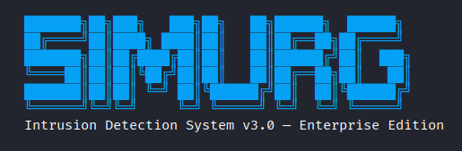
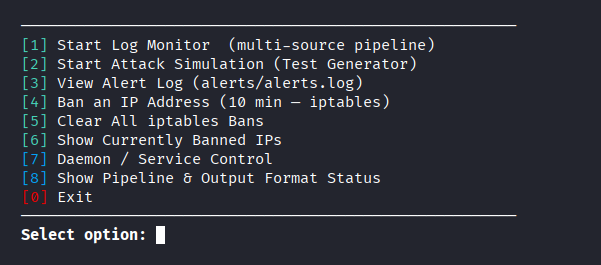
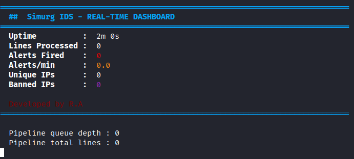
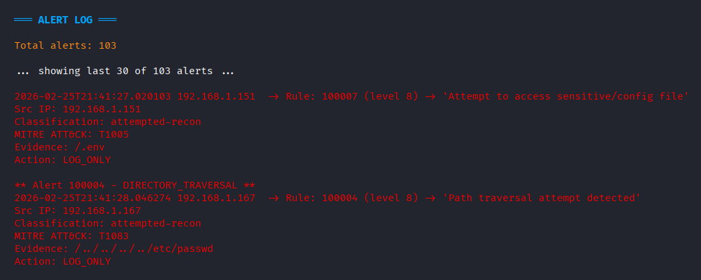
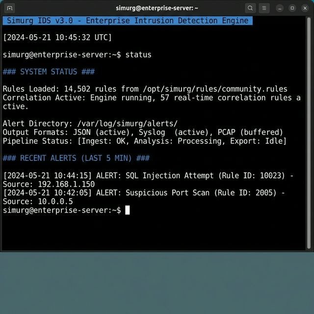

# Simurg IDS v3.0 (Enterprise Edition)

[](https://www.python.org/downloads/release/python-380/)
[](https://opensource.org/licenses/MIT)
[](https://github.com/yourusername/Simurg-IDS/graphs/commit-activity)
[](https://github.com/yourusername/Simurg-IDS)

Simurg is a modular, high-performance **Intrusion Detection System (IDS)** designed for real-time log monitoring, traffic analysis, and automated threat response. Built to support multiple log formats, Simurg provides alerting in industry-standard SIEM formats with zero external dependencies.



## 📸 Screenshots
<table align="center">
  <tr>
    <th align="center">Main Menu</th>
    <th align="center">Real-time Detection</th>
  </tr>
  <tr>
    <td align="center"></td>
    <td align="center"></td>
  </tr>
  <tr>
    <th align="center">Alert Log Output</th>
    <th align="center">Pipeline Status</th>
  </tr>
  <tr>
    <td align="center"></td>
    <td align="center"></td>
  </tr>
</table>

## 🚀 Key Features

*   **Multi-Source Ingestion**: Seamless, real-time monitoring of local files (`tail -f` style), UDP Syslog streams, and standard input (Stdin).
*   **Zero Dependencies**: Core logic runs on pure Python 3 standard library, ensuring maximum compatibility and portability across environments.
*   **Advanced Core Rule Engine**:
    *   **Web Attacks**: Deep packet inspection for SQL Injection, Cross-Site Scripting (XSS), Directory Traversal, and LFI/RFI.
    *   **Brute Force Detection**: Intelligent thresholding combined with time-window tracking for HTTP and SSH login failures.
    *   **Scanning & Reconnaissance**: Identifies known automated tools (Nikto, Nmap, Masscan) via User-Agent profiling and path enumeration patterns.
    *   **Statistical Deviation**: Detects unusual traffic spikes and DDoS behaviors using dynamic rolling-window baselines.
*   **SIEM-Ready Integrations**: Native output support for **Elastic Common Schema (ECS) JSON**, **Suricata EVE JSON**, **ArcSight CEF**, and standard plaintext logs.
*   **Active Defense**: Built-in automated threat response via `iptables` (Linux) with configurable auto-unban scheduling.
*   **Daemon & Watchdog Services**: Supports background execution with self-recovery mechanisms and systemd/service installation.

## 🛠️ Tech Stack & Architecture

- **Language**: Python 3.8+ 
- **Architecture**: Multi-threaded, asynchronous producer-consumer pipeline designed for high-throughput log ingestion.
- **Compliance**: Threat vectors and detection logic are mapped directly to the **MITRE ATT&CK** framework.

## 📦 Getting Started

### Prerequisites
*   Python 3.8 or higher
*   No external pip packages required for the core IDS engine.

### Installation

```bash
git clone https://github.com/yourusername/Simurg-IDS.git
cd Simurg-IDS
```

### Quick Launch
```bash
python simurg.py
```

## 🛡️ Detection Capabilities (MITRE ATT&CK Mapping)

| Rule ID | Threat Category | Classification | MITRE ATT&CK Tactic / Technique |
| :--- | :--- | :--- | :--- |
| **100001** | Brute Force (Web) | `attempted-admin` | Credential Access (T1110) |
| **100005** | Vulnerability Scanner | `attempted-recon` | Reconnaissance (T1595) |
| **100006** | DDoS / Flood Traffic | `denial-of-service` | Impact (T1498) |
| **100009** | SSH Brute Force | `attempted-admin` | Credential Access (T1110.001) |
| **100011** | Traffic Deviation | `unusual-traffic` | Impact (T1499) |

## 🧪 Simulation & Testing

Simurg includes a built-in, realistic attack traffic generator (`log_generator.py`) to verify rule accuracy and system performance safely on your local machine.

1.  **Start the Simulator**: Generates thousands of lines of normal traffic mixed with simulated attacks (SQLi, XSS, Scans).
    ```bash
    python log_generator.py
    ```
2.  **Monitor with Simurg**: Run `simurg.py` in a separate terminal and use the interactive menu to attach the IDS to the generated log stream.

## 📄 License & Legal

Distributed under the MIT License. See `LICENSE` for more information.

---
<div align="center">
  <b>Built for security researchers, SOC analysts, and system administrators.</b>
</div>
